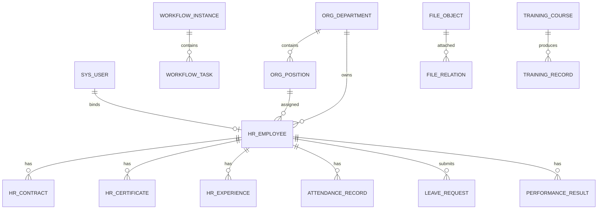

# 数据模型设计

## 核心实体关系

## 表设计清单

| 表名 | 用途 | 关键字段 |
|---|---|---|
| `sys_user` | 登录用户 | `id`, `username`, `password_hash`, `employee_id`, `status` |
| `sys_role` | 角色 | `id`, `code`, `name`, `data_scope`, `status` |
| `sys_permission` | 菜单/按钮权限 | `id`, `type`, `code`, `name`, `path`, `parent_id` |
| `sys_user_role` | 用户角色关系 | `user_id`, `role_id` |
| `org_department` | 组织部门 | `id`, `parent_id`, `name`, `code`, `manager_id`, `status` |
| `org_position` | 岗位 | `id`, `dept_id`, `name`, `sequence`, `level`, `headcount` |
| `org_job_level` | 职级 | `id`, `code`, `name`, `rank`, `sequence` |
| `hr_employee` | 员工主档 | `id`, `employee_no`, `name`, `dept_id`, `position_id`, `status` |
| `hr_employee_profile` | 员工扩展信息 | `employee_id`, `gender`, `birthday`, `id_card`, `address` |
| `hr_contract` | 合同 | `id`, `employee_id`, `contract_no`, `start_date`, `end_date`, `file_id` |
| `hr_certificate` | 证书 | `id`, `employee_id`, `name`, `cert_no`, `expire_date`, `file_id` |
| `hr_experience` | 经历 | `id`, `employee_id`, `type`, `organization`, `start_date`, `end_date` |
| `hr_employment_change` | 任职变更 | `id`, `employee_id`, `change_type`, `from_value`, `to_value`, `effective_date` |
| `onboarding_task` | 入职清单 | `id`, `employee_id`, `task_name`, `owner_id`, `status` |
| `resignation_handover` | 离职交接 | `id`, `employee_id`, `item`, `owner_id`, `status` |
| `attendance_record` | 考勤记录 | `id`, `employee_id`, `work_date`, `clock_in`, `clock_out`, `status` |
| `leave_request` | 请假申请 | `id`, `employee_id`, `leave_type`, `start_at`, `end_at`, `status` |
| `overtime_request` | 加班申请 | `id`, `employee_id`, `start_at`, `end_at`, `hours`, `status` |
| `performance_cycle` | 绩效周期 | `id`, `name`, `start_date`, `end_date`, `status` |
| `performance_result` | 绩效结果 | `id`, `cycle_id`, `employee_id`, `score`, `grade`, `status` |
| `training_course` | 培训课程 | `id`, `name`, `teacher`, `start_at`, `end_at`, `status` |
| `training_record` | 培训记录 | `id`, `course_id`, `employee_id`, `progress`, `score`, `status` |
| `workflow_instance` | 流程实例 | `id`, `biz_type`, `biz_id`, `starter_id`, `status` |
| `workflow_task` | 流程任务 | `id`, `instance_id`, `assignee_id`, `node_name`, `status` |
| `file_object` | 文件对象 | `id`, `bucket`, `object_key`, `filename`, `mime_type`, `size` |
| `file_relation` | 附件关联 | `id`, `file_id`, `biz_type`, `biz_id`, `usage` |
| `notification` | 通知 | `id`, `receiver_id`, `title`, `content`, `status` |
| `audit_log` | 审计日志 | `id`, `actor_id`, `action`, `resource_type`, `resource_id`, `ip` |

## 数据约束

- 员工编号全局唯一。
- 在职员工必须关联有效部门和岗位。
- 合同、证书、经历必须关联员工。
- 流程实例的 `biz_type + biz_id` 指向具体业务单据。
- 附件必须通过 `file_relation` 关联业务对象，不直接散落在业务表。
- 审计日志不可物理删除。

## 敏感字段

| 字段 | 处理方式 |
|---|---|
| 身份证号 | 默认脱敏，授权后查看 |
| 手机号 | 普通列表脱敏，详情按权限查看 |
| 合同附件 | 仅 HR 管理员、员工本人授权查看 |
| 薪酬基础数据 | 单独角色授权 |
| 审计日志 IP | 仅系统管理员和审计可见 |
