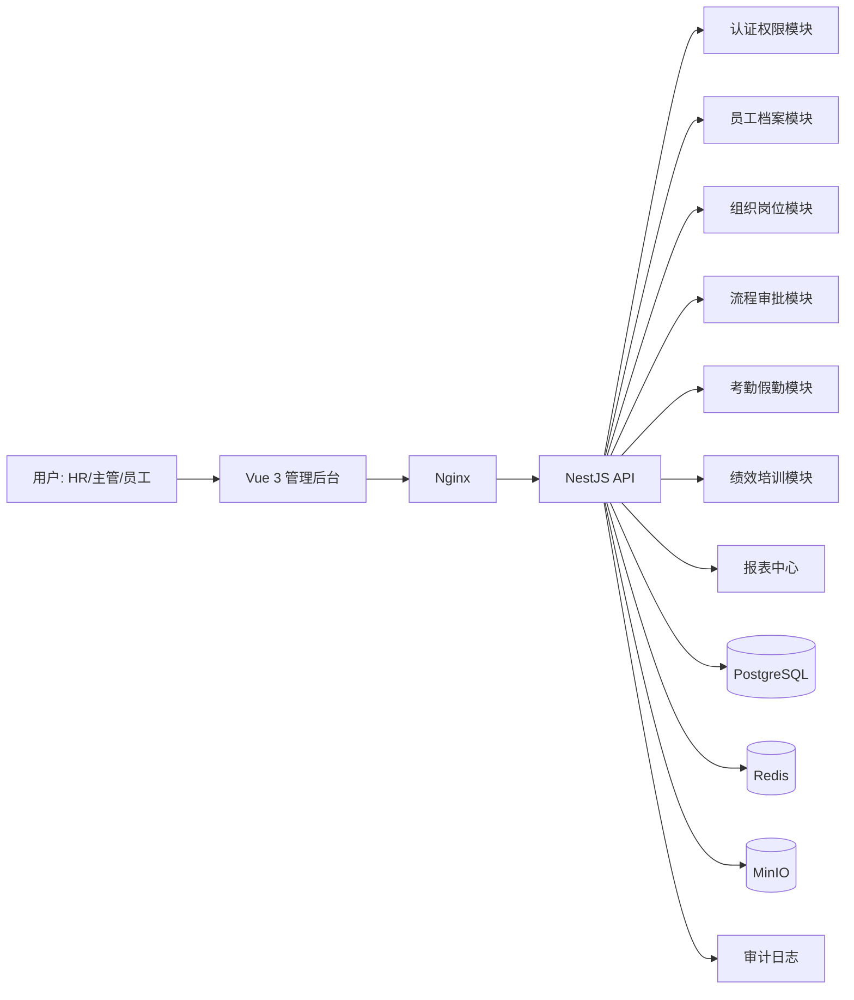

# 系统架构与工程骨架

## 架构目标

- 前后端分离，前端负责后台交互体验，后端负责业务服务和权限边界。
- 使用 PostgreSQL 保存核心业务数据，Redis 保存缓存、会话、分布式锁、轻量队列。
- 使用 MinIO 保存合同、证书、流程材料、导出报表等附件。
- 使用 Docker + Nginx 实现本地、测试、预生产、生产环境部署一致性。

## 逻辑架构



## 工程目录

```text
hr-management-system/
  apps/
    frontend/          # Vue 3 + TypeScript + Vite
    backend/           # NestJS + TypeScript
  deploy/
    nginx/             # Nginx 反向代理配置
  docs/
    requirements/      # 需求文档
    design/            # UI/UX 与权限报表设计
    architecture/      # 架构与数据模型
    api/               # API 规划
    test/              # 测试计划
    deployment/        # 部署与 GitHub 工程规范
    acceptance/        # 验收与里程碑
  deliverables/        # 立项阶段生成的 Word/Excel/SVG 资料
  docker-compose.yml
  package.json
```

## 后端分层

| 层 | 职责 | 示例 |
|---|---|---|
| Controller | 接收 HTTP 请求、参数校验、返回响应 | `EmployeesController` |
| Service | 业务规则、流程编排、权限检查 | `HrDataService` 后续拆分 |
| Repository | 数据访问、事务、查询优化 | Prisma/ORM Repository |
| Integration | Redis、MinIO、消息通知、外部系统 | FileService、NotifyService |
| Common | 异常、日志、审计、分页、鉴权装饰器 | `AuthGuard`、`AuditInterceptor` |

## 前端分层

| 层 | 职责 |
|---|---|
| `pages` | 路由页面：员工、组织、审批、报表 |
| `components` | 表格、表单、附件上传、流程时间线 |
| `api` | HTTP 请求封装、接口类型 |
| `stores` | 用户、权限、字典、全局状态 |
| `styles` | 设计令牌、布局、响应式规则 |

## 工程骨架完善路线

1. 拆分后端模块：auth、org、employee、contract、workflow、attendance、performance、training、report、file、audit。
2. 接入真实 PostgreSQL，通过迁移脚本管理表结构。
3. 接入 JWT 与 RBAC，前后端同时实现权限控制。
4. 接入 MinIO 文件上传、预览、下载。
5. 接入 Redis 缓存、流程待办提醒和锁。
6. 补充端到端测试和 GitHub Actions。
