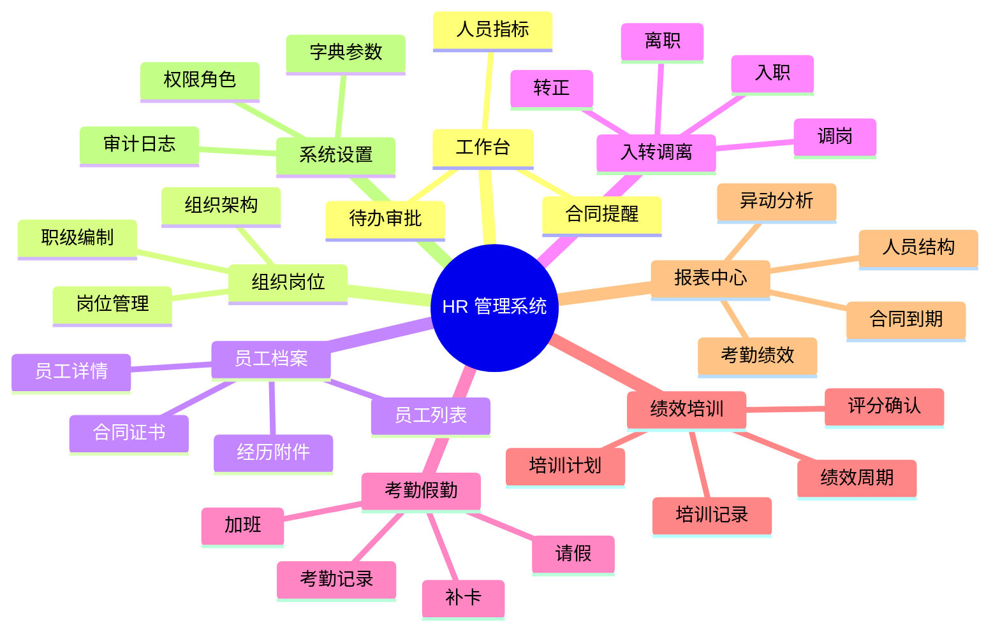

# 页面清单与后台体验设计

## 设计方向

采用清晰、克制、可扫描的后台系统设计。视觉风格参考 Swiss 管理后台：白底、细分割线、明确层级、左侧导航、顶部上下文、数据表格和表单为核心。避免装饰性视觉，优先保证 HR 高频工作效率。

## 信息架构

## 页面清单

| 一级菜单 | 页面 | 关键能力 | 组件形态 |
|---|---|---|---|
| 登录 | 登录页 | 账号密码、验证码、错误提示 | 表单 |
| 工作台 | HR 工作台 | 待办、提醒、指标、快捷入口 | 指标卡、列表 |
| 组织岗位 | 组织架构 | 部门树、新增编辑、启停用 | 树 + 表单 |
| 组织岗位 | 岗位管理 | 岗位列表、职级、编制、负责人 | 表格 + 抽屉 |
| 员工档案 | 员工列表 | 查询、筛选、导入、导出、新增 | 表格 + 工具栏 |
| 员工档案 | 员工详情 | 基础、任职、合同、证书、经历、附件 | 标签页 |
| 员工档案 | 合同台账 | 合同期限、续签、到期提醒 | 表格 + 日期筛选 |
| 员工档案 | 证书台账 | 证书有效期、附件、岗位适配 | 表格 |
| 入转调离 | 入职管理 | 预入职、材料清单、入职确认 | 步骤条 |
| 入转调离 | 转正管理 | 转正提醒、审批、结果归档 | 列表 + 流程 |
| 入转调离 | 调岗管理 | 调岗申请、审批、生效记录 | 表单 + 流程 |
| 入转调离 | 离职管理 | 离职申请、交接、归档 | 步骤条 |
| 考勤假勤 | 考勤记录 | 导入、异常、补卡 | 表格 |
| 考勤假勤 | 请假管理 | 假期余额、请假审批、销假 | 表单 + 列表 |
| 考勤假勤 | 加班管理 | 加班申请、调休、确认 | 表单 + 列表 |
| 绩效培训 | 绩效周期 | 周期、模板、评分进度 | 看板 + 表格 |
| 绩效培训 | 培训计划 | 课程、讲师、报名、完成率 | 表格 + 抽屉 |
| 报表中心 | 人事报表 | 结构、异动、合同、考勤、绩效、培训 | 图表 + 导出 |
| 系统设置 | 角色权限 | 角色、菜单、按钮、数据范围 | 表格 + 树 |
| 系统设置 | 审计日志 | 操作日志、登录日志、导出日志 | 表格 |

## 表单交互规范

- 必填字段显示明确标识，错误提示出现在字段下方。
- 员工档案采用分组表单：基础信息、任职信息、联系信息、附件。
- 大型表单采用分步保存，避免一次性提交失败导致信息丢失。
- 保存、提交审批、删除、归档等关键操作必须有加载态和结果反馈。
- 删除、离职归档、合同作废等高风险操作必须二次确认。

## 表格交互规范

- 默认支持分页、排序、筛选、列宽适配。
- 员工列表默认列：员工编号、姓名、部门、岗位、职级、入职日期、状态。
- 合同和证书类表格必须突出到期日期与状态。
- 列表导出必须记录审计日志，并按用户数据权限过滤。

## 响应式要求

- 桌面端优先，支持 1366px 以上管理后台。
- 1024px 以下左侧导航可折叠。
- 移动端重点支持审批、请假、加班、员工自助查询。
- 移动端表格改为卡片列表，保留关键字段和主要操作。
