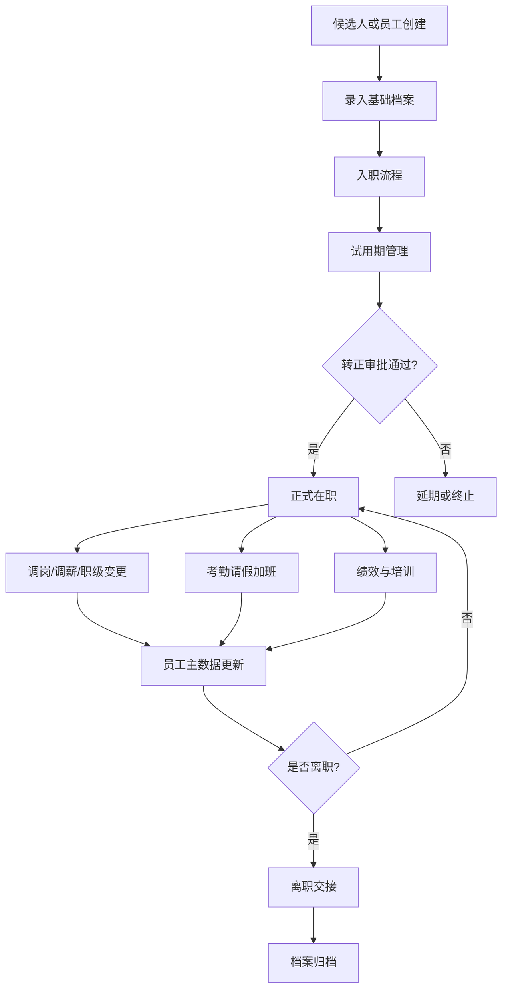
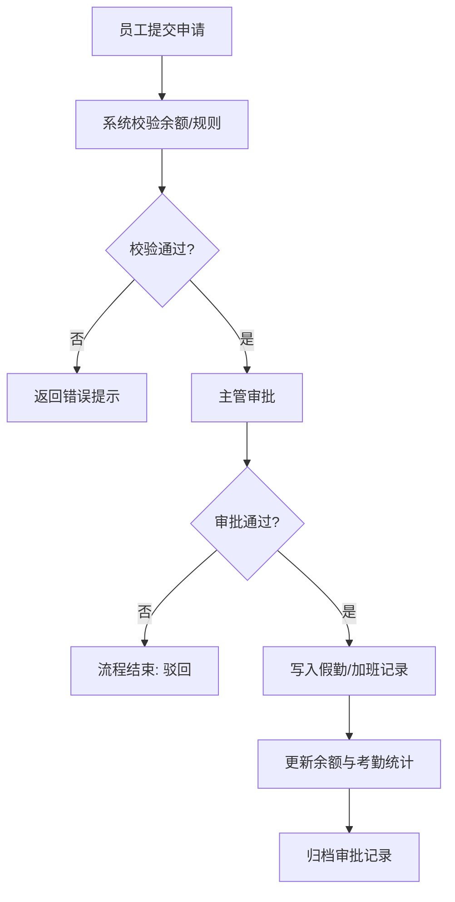

# 核心业务流程

## 员工全生命周期

## 入职流程

1. HR 创建员工预入职档案。
2. 系统校验身份证号、手机号、部门岗位、入职日期。
3. HR 上传入职材料：身份证、学历证明、合同、承诺书等。
4. 部门主管确认岗位、直属上级、试用期目标。
5. 系统生成入职清单：账号、工位、设备、培训、合同签署。
6. 入职完成后员工状态从“待入职”变为“试用”。

## 转正流程

1. 系统按试用期结束日期提前 15 天生成提醒。
2. 员工或 HR 发起转正申请。
3. 直属主管填写评价，HR 复核档案和合同。
4. 审批通过后员工状态变为“在职”，记录转正日期。
5. 审批驳回时进入延期或终止处理。

## 调岗流程

1. HR 或部门主管发起调岗申请。
2. 选择原部门/岗位、新部门/岗位、新职级、生效日期。
3. 原部门主管、新部门主管、HR 依次审批。
4. 通过后写入任职变更记录，更新员工当前岗位。
5. 同步触发编制占用变化和权限数据范围更新。

## 离职流程

1. 发起离职申请，填写离职类型、原因、计划离职日期。
2. 部门主管确认交接事项。
3. HR 确认合同、假勤、培训、档案材料。
4. 财务确认薪酬结算事项。
5. IT 或系统管理员确认账号停用。
6. 离职完成后员工状态变为“离职”，档案转入归档。

## 考勤请假加班流程

## 绩效流程

1. HR 创建绩效周期和评价模板。
2. 员工填写目标或自评。
3. 主管评分并给出评语。
4. HR 校准结果，必要时发起复议。
5. 员工确认结果，归档至员工档案。

## 培训流程

1. HR 创建培训计划、课程、讲师、对象范围。
2. 员工报名或系统按部门岗位自动分配。
3. 员工完成学习、签到或考试。
4. 系统统计完成率和考试成绩。
5. 培训记录写入员工档案。
